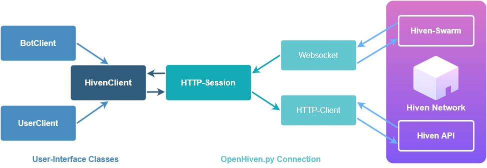

# Introduction to OpenHiven.py

---

Welcome to the Introduction to OpenHiven.py!

OpenHiven.py is an easy, fast and async API wrapper written in Python
that provides extensive functionality for the Hiven Swarm and Hiven API.

The OpenHiven.py module is entirely written in async and can therefore only be used in an
async event loop and environment. For more info about asyncio look into the [Asyncio documentation](https://docs.python.org/3/library/asyncio.html)

## Environment

To use OpenHiven.py Python >= 3.6 is required since the package aiohttp needs Python
functionality which is only available in Python >= 3.6!
Python 2 is entirely not supported, and currently, there is no plan to make OpenHiven.py available for Python 2,
since many features are dependent on Python 3 and the modern async module of Python 3 as well as aiohttp!

## Installation


=== "PyPi Installation"

    ```
    python3 -m pip install -U openhivenpy
    ```

=== "Specific Version"

    ```
    python3 -m pip install -U openhivenpy==version
    ```

=== "Github Build"

    ```
    python3 -m pip install -U https://github.com/FrostbyteSpace/OpenHiven.py/archive/main.zip
    ```

## Basic Concept

The system of OpenHiven.py is very closely related to the discord.py(Discord Python Wrapper) module and
was structured to be similar to it. Therefore, the basic concept is based on an event listener system where events
are mapped to user-specified functions and methods. These will be executed when in the websocket a Hiven Swarm Event 
is received, enabling the user to customise the event's handling!

In case of an event, Hiven will send the corresponding data over the Hiven Swarm and the websocket connection of the 
[aiohttp](https://docs.aiohttp.org/en/stable/) HTTP-Session. That data will then be passed to the HivenClient where 
the Hiven Swarm message will get processed, and an event would be triggered.



You can then specify in the Event Listener how the Client should react to such issues using the standard 
[decorators](https://wiki.python.org/moin/PythonDecorators#What_is_a_Decorator). The methods will get the data passed, 
and you can utilise it right afterwards.

This event system and handling is done over the integrated [Event Handler](https://openhivenpy.readthedocs.io/en/latest/)
class, which defaults to the used Client itself. Async Functions that are tagged with the `@client.event()` 
[decorator](https://wiki.python.org/moin/PythonDecorators#What_is_a_Decorator) will automatically be saved in the 
EventHandler and then called whenever an Event is triggered.

!!! Example
    
    Example with the event `on_message_create`

    ```python
        ...

        @client.event()
        async def on_message_create(msg):
            print(f"{msg.author.name} send a message: {msg.content}")

        ...
    ```

### Using a UserClient
[{: width=28px align=top} Source Code ·`openhivenpy.UserClient`](https://github.com/FrostbyteSpace/openhiven.py/blob/main/openhivenpy/client/userclient.py)

A UserClient object is an object that wraps the default [HivenClient](https://openhivenpy.readthedocs.io/en/latest/),
which serves as a bridge between Hiven, and the Program you are using. The [HivenClient](https://openhivenpy.readthedocs.io/en/latest/)
contains all data and connection-vital information, but is not supposed to be used directly since some methods
are not available due to the raw state. These are special methods related to the bot-type that decides based on what 
type you are using, resulting in various functionality. These two bot-types are here [UserClient](https://openhivenpy.readthedocs.io/en/latest/) 
and [BotClient](https://openhivenpy.readthedocs.io/en/latest/)

To use the UserClient, you are also required to have a token passed, which it can use to authorise on Hiven and request data.
If no token were passed, it would automatically raise an `openhivenpy.exceptions.exception.InvalidToken` Exception!

!!! Example

    === "Regular"

        ```python
        
        import openhivenpy as hiven
        
        client = hiven.UserClient("Insert token")
        
        @client.event()
        async def on_ready():
            print("Bot is ready")

        client.run()
        
        ```

    === "Inherited"

        Decorators are useful for beginners and for a quick setup, but it is recommended to use a class which 
        inherits the HivenClient, making the Event listener directly find the methods when needed without needing 
        the methods to be registered.

        This can save time as well as remove unneeded logic

        ```python
        import openhivenpy as hiven
        
        class Bot(hiven.UserClient):
            def __init__(self, token):
                self._token = token
                # Calling __init__ of the parent class and inheriting all methods and functionality
                super().__init__(token)
        
            # Not directly needed but protects the token from ever being changed!
            @property
            def token(self):
                return self._token
        
            # Methods can be defined directly in the class 
            async def on_ready(self):
                print("Bot is ready!")
        
        
        if __name__ == '__main__':
            client = Bot(token="Insert token")
            client.run()
        ```

### Using a BotClient
[{: width=28px align=top} Source Code ·`openhivenpy.BotClient`](https://github.com/FrostbyteSpace/openhiven.py/blob/main/openhivenpy/client/botclient.py)

A Bot Client like the UserClient is a wrapper for the main HivenClient class. It serves as a Class using bot
functionality on Hiven. Therefore, it's usage is very similar, but it can specifically utilise Methods and functions
related to text-commands and will likely receive in future versions more modules specifically adding that functionality.

!!! note 

    The current release v0.1.2 the Bot-Client lacks optimisation and can break using it. 
    Therefore, bugs are likely to occur! If you encounter bugs, please report them!


### Hiven-Types
<!---
# Using an .ico since readthedocs doesn't support emoji generation
-->
[{: width=28px align=top} Source Code ·`openhivenpy.types`](https://github.com/FrostbyteSpace/openhiven.py/blob/main/openhivenpy/types/)

You might have already noticed in prior examples that instead of raw data OpenHiven.py sends entire instances of Classes 
with the event data as parameters. This is because of the type-system OpenHiven.py uses where objects are created and 
initialised parallel to the corresponding Hiven ones, making it easier for usage due to the easy attribute
and data access. 

These instances can then be used to interact with the Hiven API directly instead of needing to write own requests for 
data and updating the objects accordingly. For each possible request OpenHiven.py adds a method to the class which 
automatically changes data and returns configured objects if that specific methods returns data.

For detailed documentation see [Data Models](https://openhivenpy.readthedocs.io/en/latest/)
